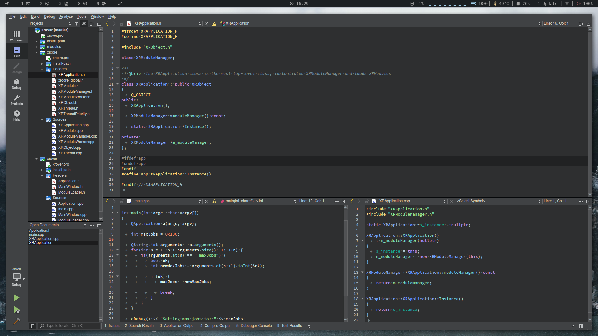

# QtCreator XSyntaxMaterial Color Scheme
A dark colored scheme for QtCreator that I use, works great with the default Flat Dark theme.
Loosely based on [Atom Material Syntax Theme](https://atom.io/themes/atom-material-syntax) color palette and the defaults of Qt Creator Dark color scheme.

## Note
It uses Material colors or their slight modifications for all C++ syntax, but they were modified to have an overall colder feel (the red and pink were too intrusive), now the kinda look like Visual Studio colors.
The QML syntax and the Diff editor syntax are left as defaults.

## Installation

There is an [install](install.sh) script available, which will copy the color scheme file to the default linux QtCreator config directory

### Automatic Installation
- **Clone or download this repository**

  `git clone https://github.com/xgallom/qt-creator-XSyntaxMaterial.git`

- **Run the install.sh script from the project root directory**

  `cd qt-creator-XSyntaxMaterial && ./install.sh`

### Manual Installation
- **Clone or download this repository**

  `git clone https://github.com/xgallom/qt-creator-XSyntaxMaterial.git`

- **Copy the color scheme to QtCreators styles directory**

  QtCreator stores styles in different locations on different operating systems:
  - *Windows:* `%APPDATA%\QtProject\qtcreator\styles`
  - *Linux, Mac:* `~/.config/QtProject/qtcreator/styles`

  `cp qt-creator-XSyntaxMaterial/xsyntaxmaterial.xml ~/.config/QtProject/qtcreator/styles/`

### Configuring the QtCreator IDE
- **Open QtCreator and set the color scheme to XSyntaxMaterial**

  - Go to `Tools -> Options -> Text Editor -> Fonts & Colors`
  - Change Color scheme to **XSyntaxMaterial**

- **_(Optional) Also set the QtCreator theme to Flat Dark_**

  - Go to `Tools -> Options -> Environment -> Interface`
  - Change Theme to **Flat Dark**
  - Restart QtCreator

  _Note: Changing theme might change your color scheme to default,
  so I recommend changing it **before** setting your color scheme._

## Features
- Default background colors of QtCreators Flat Dark theme
- Modern and readable look of [Atom Material Syntax Theme](https://atom.io/themes/atom-material-syntax) with few modifications to keep the code clear in the darker QtCreator theme
- Different colors for **Types**, **Primitive Types**, **Global Variables**, **Local Variables** and **Functions**

## Contributing
If I never get to finish the QML and Diff highlights, and you want to do your part, just hit me with a pull request and if it's good then it's good!

## License
This project is licensed under MIT License - see the [LICENSE.md](LICENSE.md) file for details

## Author
Milan Gallo - [xgallom](https://github.com/xgallom)

